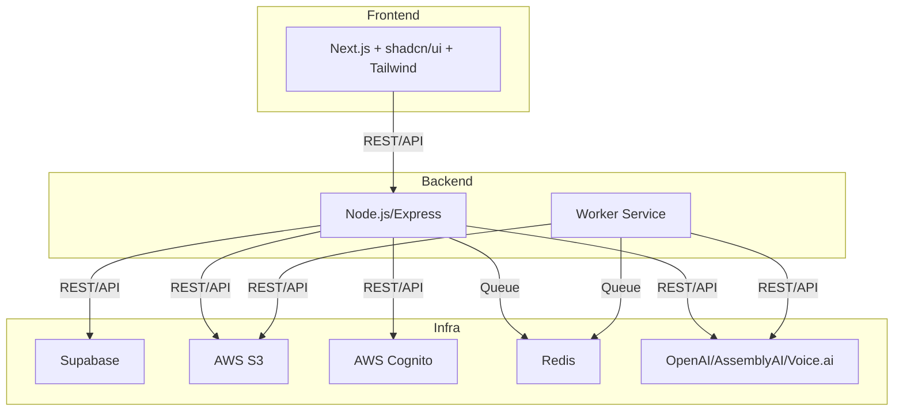

# AI Video Generation Pipeline – Tech Stack & Architecture Reference

## Table of Contents
1. [Monorepo & Turborepo](#monorepo--turborepo)
2. [Frontend: Next.js + shadcn/ui + TailwindCSS](#frontend-nextjs--shadcnui--tailwindcss)
3. [Backend: Node.js/Express](#backend-nodejsexpress)
4. [Worker Service](#worker-service)
5. [Supabase (Database)](#supabase-database)
6. [AWS Cognito (Authentication)](#aws-cognito-authentication)
7. [AWS S3 (Media Storage)](#aws-s3-media-storage)
8. [Bull (Job Queue) & Redis](#bull-job-queue--redis)
9. [OpenAI, AssemblyAI, VoCloner, Voice.ai (AI Integrations)](#openai-assemblyai-vocloner-voiceai-ai-integrations)
10. [Docker & Docker Compose](#docker--docker-compose)
11. [CI/CD: GitHub Actions](#cicd-github-actions)
12. [Shared Packages & Types](#shared-packages--types)
13. [Best Practices & Configuration](#best-practices--configuration)
14. [Production-Grade Practices (2025 Update)](#production-grade-practices-2025-update)

---

## Monorepo & Turborepo

### Core Functionality
- **Monorepo**: Single repository for all services (frontend, backend, worker, shared code).
- **Turborepo**: High-performance build system for monorepos, orchestrates builds, dev, lint, and type-checking across all packages.

### Why This Choice?
- **Monorepo**: Simplifies dependency management, code sharing, and refactoring across services.
- **Turborepo**: Fast, modern, supports caching, parallelization, and is designed for JS/TS monorepos.

### Integration
- All apps and packages are defined in `pnpm-workspace.yaml` and `turbo.json`.
- Shared code is in `/packages/shared`.

### How It Works
- Turborepo uses a task pipeline (see `turbo.json`) to run scripts in each workspace.
- Caches outputs to speed up repeated builds/tests.

### Config/Best Practices
- Use `pnpm` for workspace management.
- Add new apps/packages to `pnpm-workspace.yaml`.
- Use `turbo run <task>` for orchestrated commands.

---

## Frontend: Next.js + shadcn/ui + TailwindCSS

### Core Functionality
- **Next.js**: React framework for SSR, SSG, and API routes.
- **shadcn/ui**: Headless, accessible UI components.
- **TailwindCSS**: Utility-first CSS framework.

### Why This Choice?
- **Next.js**: Best-in-class for React SSR/SSG, great DX, Vercel support.
- **shadcn/ui**: Modern, composable, accessible, easy to customize.
- **TailwindCSS**: Rapid UI development, consistent design, minimal CSS bloat.

### Integration
- Frontend calls backend APIs, uses Cognito for auth, S3 for uploads, Supabase for data.
- Consumes shared types from `/packages/shared`.

### How It Works
- Next.js handles routing, SSR, and static export.
- shadcn/ui provides UI primitives, styled with Tailwind.
- Tailwind processes classnames at build time for minimal CSS.

### Config/Best Practices
- Use `@aws-amplify` and `@supabase/supabase-js` for integration.
- Configure Tailwind in `tailwind.config.js`.
- Use SWR for data fetching and caching.

---

## Backend: Node.js/Express

### Core Functionality
- REST API for authentication, video job management, and integration with external services.

### Why This Choice?
- **Express**: Minimal, flexible, huge ecosystem, easy to extend.
- **Node.js**: Non-blocking, event-driven, ideal for I/O-heavy workloads.

### Integration
- Handles requests from frontend, manages job queue (Bull), talks to Supabase, S3, Cognito, and AI services.
- Publishes jobs for the worker service.

### How It Works
- Express routes handle HTTP requests.
- Middleware for auth, validation, error handling.
- Uses services for business logic (e.g., video processing, S3 uploads).

### Config/Best Practices
- Use environment variables for secrets.
- Organize code by feature (controllers, services, routes).
- Use async/await for all I/O.

---

## Worker Service

### Core Functionality
- Processes long-running or resource-intensive jobs (audio generation, video assembly, browser automation).

### Why This Choice?
- Keeps backend API responsive.
- Isolates heavy/unstable tasks (e.g., browser automation) from main API.

### Integration
- Listens to Bull queues (Redis).
- Communicates with backend via shared DB or events.

### How It Works
- Consumes jobs from Redis.
- Runs browser automation (Puppeteer), calls AI APIs, uploads results to S3.

### Config/Best Practices
- Use separate containers for worker and backend.
- Monitor job failures and retries.

---

## Supabase (Database)

### Core Functionality
- Managed Postgres database with instant REST and realtime APIs.

### Why This Choice?
- Fast setup, built-in auth, RLS, generous free tier, Postgres compatibility.

### Integration
- Backend uses `@supabase/supabase-js` for DB access.
- RLS policies enforce per-user data access.

### How It Works
- Tables for users, videos, jobs.
- RLS policies restrict access to user-owned data.

### Config/Best Practices
- Always enable RLS.
- Use SQL migrations for schema changes.

---

## AWS Cognito (Authentication)

### Core Functionality
- User authentication and management (sign up, login, JWT issuance).

### Why This Choice?
- Managed, secure, integrates with AWS ecosystem, supports OAuth/social logins.

### Integration
- Frontend uses AWS Amplify for auth flows.
- Backend validates JWTs for protected routes.

### How It Works
- User pool manages users.
- App client issues JWTs on login.
- JWTs are validated on each request.

### Config/Best Practices
- Store pool/client IDs in `.env`.
- Enforce strong password policies.

---

## AWS S3 (Media Storage)

### Core Functionality
- Stores user-uploaded and generated media (audio, video, thumbnails).

### Why This Choice?
- Scalable, reliable, cheap, easy to integrate.

### Integration
- Backend uploads/serves files via AWS SDK.
- Frontend can use signed URLs for direct uploads/downloads.

### How It Works
- Files are uploaded with unique keys.
- Signed URLs provide secure, time-limited access.

### Config/Best Practices
- Block public access unless needed.
- Use signed URLs for all client access.

---

## Bull (Job Queue) & Redis

### Core Functionality
- **Bull**: Job queue for background processing.
- **Redis**: In-memory store for queue state.

### Why This Choice?
- Bull: Simple, robust, supports retries, progress, and concurrency.
- Redis: Fast, widely supported, easy to run locally or in cloud.

### Integration
- Backend enqueues jobs.
- Worker consumes and processes jobs.

### How It Works
- Jobs are JSON payloads in Redis.
- Bull manages job state, retries, and events.

### Config/Best Practices
- Use unique job IDs for idempotency.
- Monitor queue health and failures.

---

## OpenAI, AssemblyAI, VoCloner, Voice.ai (AI Integrations)

### Core Functionality
- **OpenAI**: Text-to-script generation.
- **AssemblyAI**: Audio-to-text/captions.
- **VoCloner/Voice.ai**: Voice synthesis/enhancement.

### Why This Choice?
- Best-in-class models, easy API, high quality.

### Integration
- Backend/worker call APIs as part of job processing.

### How It Works
- Send HTTP requests with API keys.
- Receive results (text, audio, captions) for further processing.

### Config/Best Practices
- Store API keys in `.env`.
- Handle rate limits and errors gracefully.

---

## Docker & Docker Compose

### Core Functionality
- Containerizes each service for local dev and deployment.

### Why This Choice?
- Consistent environments, easy onboarding, works everywhere.

### Integration
- Each app has its own Dockerfile.
- Compose orchestrates all services.

### How It Works
- `docker-compose up` builds and runs all containers.
- Services communicate via internal network.

### Config/Best Practices
- Use multi-stage builds for smaller images.
- Mount volumes for local dev if needed.

---

## CI/CD: GitHub Actions

### Core Functionality
- Automates linting, build, and type-checking on every push/PR.

### Why This Choice?
- Free for public repos, easy to configure, integrates with GitHub.

### Integration
- Workflow defined in `.github/workflows/ci.yml`.

### How It Works
- Runs `pnpm install`, `pnpm lint`, `pnpm build`, `pnpm check-types` on each commit.

### Config/Best Practices
- Fail fast on errors.
- Add deploy steps as needed.

---

## Shared Packages & Types

### Core Functionality
- Share TypeScript types, utilities, and config across all apps.

### Why This Choice?
- DRY code, type safety, easy refactoring.

### Integration
- Imported as `@ai-video-pipeline/shared` in any app.

### How It Works
- Standard TypeScript package in `/packages/shared`.

### Config/Best Practices
- Keep shared code generic and stable.
- Version shared packages if needed.

---

## Best Practices & Configuration

- **Environment Variables**: Use `.env.example` as a template, never commit secrets.
- **Error Handling**: Centralize error handling in backend/worker.
- **Testing**: Use Jest for backend, React Testing Library for frontend, Cypress for E2E.
- **Monitoring**: Use Winston for logging, add error tracking (e.g., Sentry) as needed.
- **Security**: Validate all inputs, use HTTPS, keep dependencies up to date.

---

## Example Architecture Diagram



---

## Example: S3 Signed URL (Node.js)

```ts
import { S3Client, PutObjectCommand } from '@aws-sdk/client-s3';
import { getSignedUrl } from '@aws-sdk/s3-request-presigner';

const s3 = new S3Client({ region: process.env.AWS_REGION });
const command = new PutObjectCommand({
  Bucket: process.env.AWS_S3_BUCKET,
  Key: 'uploads/myfile.mp4',
  ContentType: 'video/mp4',
});
const url = await getSignedUrl(s3, command, { expiresIn: 3600 });
```

---

## Example User Workflow: From Auth to Final Video Output

1. **User Registration & Login**
   - User signs up or logs in via the frontend (Next.js) using AWS Cognito (email/password or OAuth).
   - Cognito issues a JWT, which is stored in the frontend and sent with all API requests.

2. **Video Creation Request**
   - Authenticated user submits a video creation form (prompt, title, etc.) on the dashboard.
   - Frontend sends a POST request to the backend `/api/videos` with the user's JWT.

3. **Backend: Job Creation**
   - Backend validates the JWT, creates a new video record in Supabase, and enqueues a processing job in Bull (Redis).
   - Returns a job ID and initial status to the frontend.

4. **Worker: Pipeline Processing**
   - Worker service picks up the job from the queue and runs the pipeline:
     1. **Script Generation**: Calls OpenAI to generate a video script from the user's prompt.
     2. **Voice Generation**: Uses Playwright to automate VoCloner, uploads script, downloads generated audio.
     3. **Audio Enhancement**: Automates voice.ai, uploads audio, downloads enhanced audio.
     4. **Caption Generation**: Sends audio to AssemblyAI for transcription and word-level timestamps.
     5. **Video Assembly**: Uses ffmpeg to combine background video, enhanced audio, and captions into a final video file.
     6. **Upload**: Uploads the final video to S3, updates Supabase with the video URL and status.

5. **Progress Tracking**
   - Backend exposes endpoints for job/video status.
   - Frontend polls or subscribes for real-time updates (status, progress, errors).

6. **User Accesses Final Video**
   - Once processing is complete, the user sees the video in their dashboard.
   - Frontend fetches a signed S3 URL for secure playback/download.

7. **(Optional) User Actions**
   - User can download, share, or delete their video.
   - All actions are protected by auth and validated by backend/Supabase RLS.

---

## Production-Grade Practices (2025 Update)

This project now includes the following real-world, enterprise-grade features:

- **Pre-commit hooks:** Husky + lint-staged enforce linting and formatting on every commit.
- **Automated dependency updates:** Dependabot config in `.github/dependabot.yml` keeps dependencies up to date with PRs.
- **Contribution workflow:**
  - [CONTRIBUTING.md](./CONTRIBUTING.md) with code style, commit, PR, and review guidelines
  - Issue templates for bugs and features
  - Pull request template for consistent PRs
- **Environment separation:** Use `.env`, `.env.staging`, `.env.production` for dev, staging, and prod config. Never commit secrets.
- **Logging:** Winston logger in backend and worker (console + file logging, error and request logs)
- **Security:**
  - Rate limiting (express-rate-limit)
  - CORS configuration (env-based)
  - Helmet for HTTP headers
  - Input validation (express-validator)
  - Dependency audit script (`pnpm audit`)
- **Testing:**
  - React Testing Library + Jest for frontend unit tests (with coverage)
  - Playwright for E2E and browser automation tests
- **CI/CD:** GitHub Actions for lint, build, type-check, and test on every PR
- **.gitignore:** Comprehensive and all build/test artifacts
- **.husky/** is tracked in git for consistent hooks across all contributors

See the rest of this document for architecture, workflow, and stack details. For contribution and workflow details, see [CONTRIBUTING.md](./CONTRIBUTING.md).

---